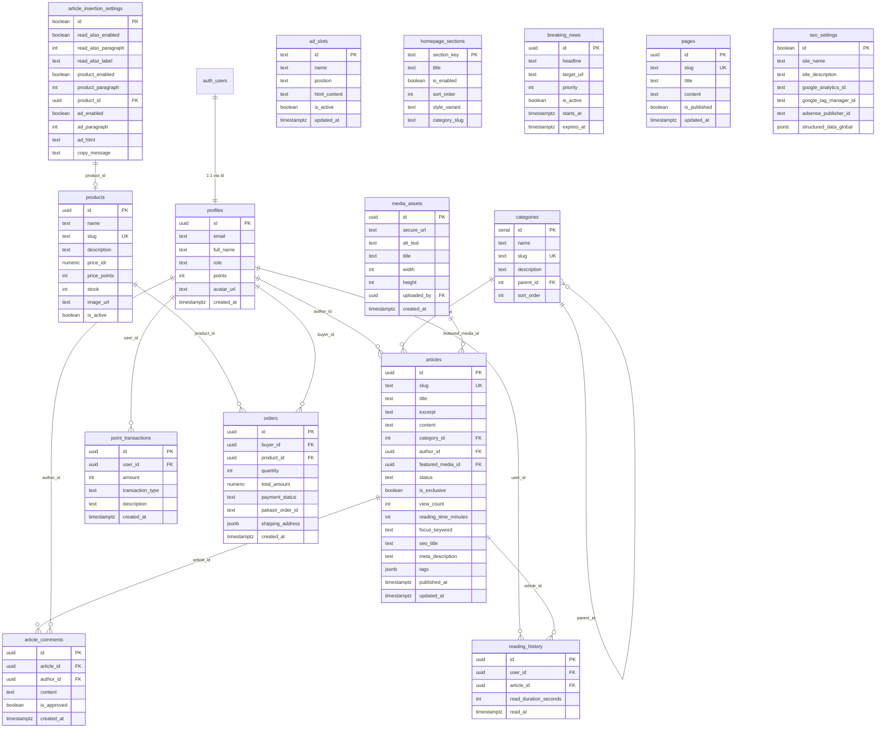

# Database Design & Schema Specification (2026 Production Standard)
**Project:** SWAPNEWS.CO.ID  
**Database Engine:** PostgreSQL 15+ (Hosted on Supabase)  
**Security Standard:** Row Level Security (RLS) Enabled on All Tables  
**Document:** DATABASE_DESIGN.md  

---

## 1. Entity-Relationship Diagram (ERD)



---

## 2. Rincian Kamus Data (Data Dictionary)

### 2.1 Tabel Inti Editorial

#### `profiles` (Data Pengguna & RBAC)
| Kolom | Tipe Data | Constraint | Deskripsi |
| :--- | :--- | :--- | :--- |
| `id` | `UUID` | PK, References `auth.users.id` | ID unik dari Supabase Auth |
| `email` | `TEXT` | NOT NULL | Alamat email terdaftar |
| `full_name` | `TEXT` | NULL | Nama lengkap pengguna |
| `role` | `TEXT` | NOT NULL, DEFAULT `'member'` | Role: `'super_admin'`, `'editor'`, `'wartawan'`, `'member'` |
| `points` | `INTEGER` | NOT NULL, DEFAULT `0` | Saldo poin reward member |
| `avatar_url` | `TEXT` | NULL | URL foto profil dari Cloudinary/Storage |
| `created_at` | `TIMESTAMPTZ` | DEFAULT `NOW()` | Tanggal pendaftaran |

#### `categories` (Kanal & Taksonomi)
| Kolom | Tipe Data | Constraint | Deskripsi |
| :--- | :--- | :--- | :--- |
| `id` | `SERIAL` | PK | ID numerik unik |
| `name` | `TEXT` | NOT NULL | Nama kategori (contoh: "Ekonomi", "Bali Kini") |
| `slug` | `TEXT` | UNIQUE, NOT NULL | Slug URL (contoh: `"ekonomi"`, `"bali"`) |
| `description`| `TEXT` | NULL | Deskripsi kanal untuk SEO meta tag |
| `parent_id` | `INTEGER` | NULL, FK `categories.id` | ID induk jika merupakan sub-kategori |
| `sort_order` | `INTEGER` | DEFAULT `0` | Urutan tampilan di navbar |

#### `articles` (Konten Berita & Berita Siber)
| Kolom | Tipe Data | Constraint | Deskripsi |
| :--- | :--- | :--- | :--- |
| `id` | `UUID` | PK, DEFAULT `gen_random_uuid()` | ID unik artikel |
| `slug` | `TEXT` | UNIQUE, NOT NULL | URL ramah SEO |
| `title` | `TEXT` | NOT NULL | Judul berita |
| `excerpt` | `TEXT` | NULL | Ringkasan untuk kartu & cuplikan feed |
| `content` | `TEXT` | NULL | Isi artikel lengkap (HTML dari Tiptap) |
| `category_id`| `INTEGER` | FK `categories.id` | Kategori utama berita |
| `author_id` | `UUID` | FK `profiles.id` | Wartawan/penulis berita |
| `featured_media_id` | `UUID` | NULL, FK `media_assets.id` | Cover gambar utama |
| `status` | `TEXT` | NOT NULL, DEFAULT `'draft'` | Status: `'draft'`, `'submitted'`, `'published'`, `'revision'` |
| `is_exclusive` | `BOOLEAN` | DEFAULT `false` | Flag berita eksklusif |
| `view_count` | `INTEGER` | DEFAULT `0` | Total pembaca artikel |
| `reading_time_minutes` | `INTEGER` | DEFAULT `1` | Estimasi durasi baca |
| `focus_keyword` | `TEXT` | NULL | Kata kunci target SEO |
| `seo_title` | `TEXT` | NULL | Judul kustom untuk mesin pencari |
| `meta_description` | `TEXT` | NULL | Deskripsi meta untuk Google Indexing |
| `tags` | `TEXT[]` / `JSONB` | DEFAULT `'[]'` | Array tag artikel |
| `published_at` | `TIMESTAMPTZ`| NULL | Waktu publikasi resmi |
| `updated_at` | `TIMESTAMPTZ`| DEFAULT `NOW()` | Waktu update terakhir |

#### `media_assets` (Media & Gambar Liputan)
| Kolom | Tipe Data | Constraint | Deskripsi |
| :--- | :--- | :--- | :--- |
| `id` | `UUID` | PK, DEFAULT `gen_random_uuid()` | ID unik media |
| `secure_url` | `TEXT` | NOT NULL | URL Cloudinary (HTTPS) |
| `alt_text` | `TEXT` | NULL | Teks alternatif SEO / aksesibilitas |
| `title` | `TEXT` | NULL | Caption/keterangan foto |
| `width` | `INTEGER` | NULL | Lebar gambar asli (px) |
| `height` | `INTEGER` | NULL | Tinggi gambar asli (px) |
| `uploaded_by`| `UUID` | FK `profiles.id` | Akun pengunggah media |
| `created_at` | `TIMESTAMPTZ`| DEFAULT `NOW()` | Waktu upload |

---

### 2.2 Tabel Gamifikasi & E-Commerce

#### `reading_history` & `point_transactions`
- **`reading_history`**: Mencatat log waktu baca pembaca (`user_id`, `article_id`, `read_duration_seconds`, `read_at`) untuk mencegah klaim poin berulang.
- **`point_transactions`**: Buku besar mutasi poin (`user_id`, `amount`, `transaction_type` [earn_reading/redeem/bonus], `description`).

#### `products` & `orders`
- **`products`**: Katalog merchandise (`id`, `name`, `slug`, `price_idr`, `price_points`, `stock`, `image_url`, `is_active`).
- **`orders`**: Transaksi pembelian (`id`, `buyer_id`, `product_id`, `quantity`, `total_amount`, `payment_status` [pending/paid/expired], `pakasir_order_id`, `shipping_address`).

---

### 2.3 Tabel Kontrol CMS & Dinamisme Homepage

- **`article_insertion_settings`**: Konfigurasi tunggal (`id=true`) untuk sisipan otomatis:
  - Paragraf sisipan "Baca Juga" (`read_also_paragraph`, `read_also_label`)
  - Paragraf produk merchandise (`product_paragraph`, `product_id`)
  - Paragraf materi iklan HTML (`ad_paragraph`, `ad_html`)
  - Pesan perlindungan hak cipta copy text (`copy_message`)
- **`ad_slots`**: Slot banner iklan modular (`id`, `name`, `position`, `html_content`, `is_active`).
- **`homepage_sections`**: Urutan tampilan komponen homepage (`section_key`, `title`, `is_enabled`, `sort_order`, `style_variant`).
- **`breaking_news`**: Ticker berita kilat darurat (`id`, `headline`, `target_url`, `priority`, `is_active`, `starts_at`, `expires_at`).
- **`seo_settings`**: Pengaturan global meta webmaster, script analytics, Google Tag Manager, dan Adsense publisher (`id=true`).

---

## 3. Strategi Indexing & Optimasi Kinerja Database

Untuk menjaga latensi query tetap sub-milidetik dan mencegah lonjakan egress:

```sql
-- 1. Index untuk query daftar artikel publik (Paling sering dipanggil)
CREATE INDEX idx_articles_status_published_at ON articles (status, published_at DESC) 
WHERE status = 'published';

-- 2. Index untuk pencarian artikel per kategori
CREATE INDEX idx_articles_category_published ON articles (category_id, published_at DESC) 
WHERE status = 'published';

-- 3. Unique Index untuk pencarian cepat via URL slug
CREATE UNIQUE INDEX idx_articles_slug ON articles (slug);
CREATE UNIQUE INDEX idx_categories_slug ON categories (slug);

-- 4. Index untuk penelusuran draf wartawan
CREATE INDEX idx_articles_author_status ON articles (author_id, status);

-- 5. Index transaksi & gamifikasi
CREATE INDEX idx_reading_history_user_date ON reading_history (user_id, read_at DESC);
CREATE INDEX idx_point_transactions_user ON point_transactions (user_id, created_at DESC);
```

---

## 4. Kebijakan Keamanan Row Level Security (RLS)

1. **Tabel `articles`:**
   - `SELECT`: Terbuka untuk umum (`anon`, `authenticated`) HANYA jika `status = 'published'`. Super Admin & Editor dapat melihat semua status. Wartawan dapat melihat draf milik sendiri (`author_id = auth.uid()`).
   - `INSERT / UPDATE`: Wartawan dapat membuat draf dan mengedit draf miliknya. Editor & Super Admin dapat mengubah status publikasi.
2. **Tabel `profiles`:**
   - `SELECT`: Terbuka untuk publik (nama, avatar). Kolom privat (email, role, points) hanya bisa dibaca oleh pemilik akun dan Super Admin.
   - `UPDATE`: Pengguna hanya dapat mengedit nama/avatar sendiri; perubahan `role` dan `points` diproteksi khusus service role/super admin.
3. **Tabel Transaksi & Poin (`orders`, `point_transactions`, `reading_history`):**
   - Terisolasi penuh per `user_id = auth.uid()`.
