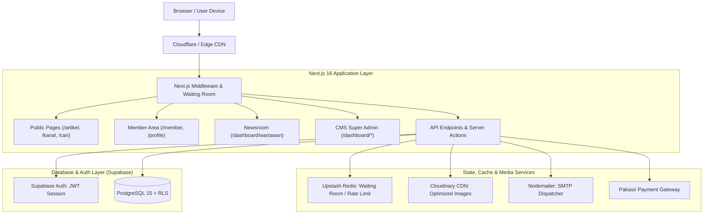
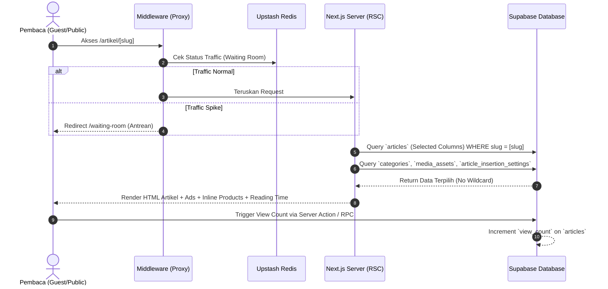
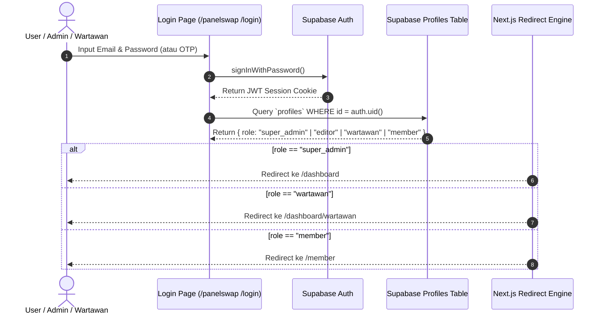
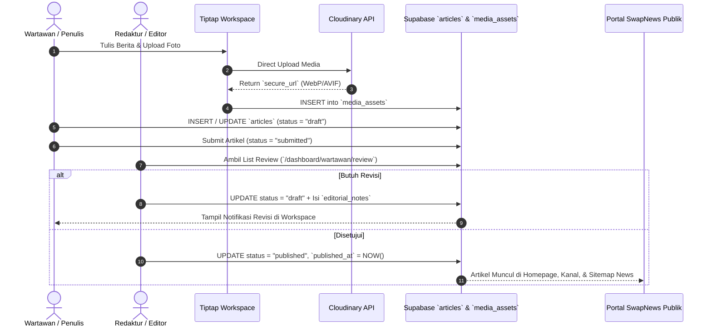
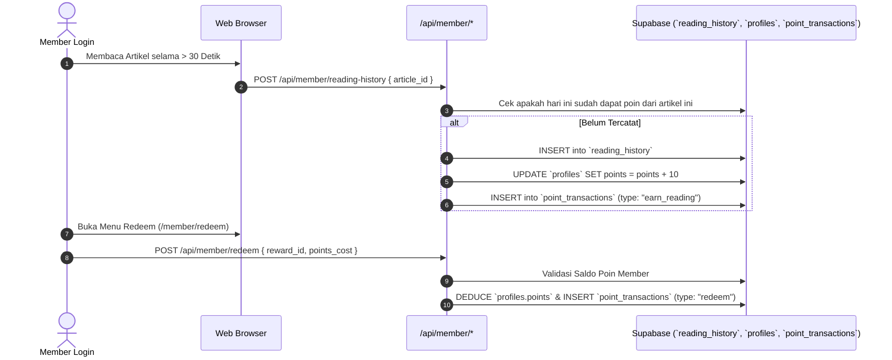
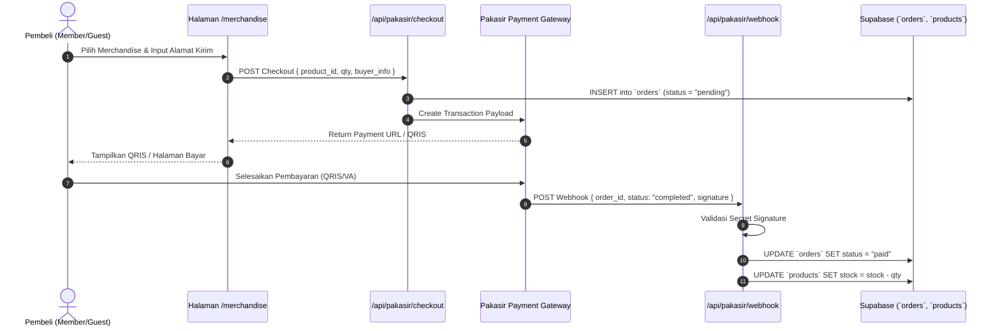
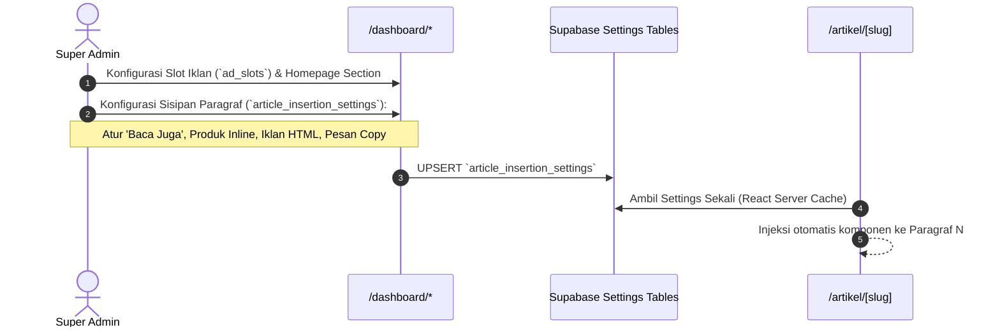
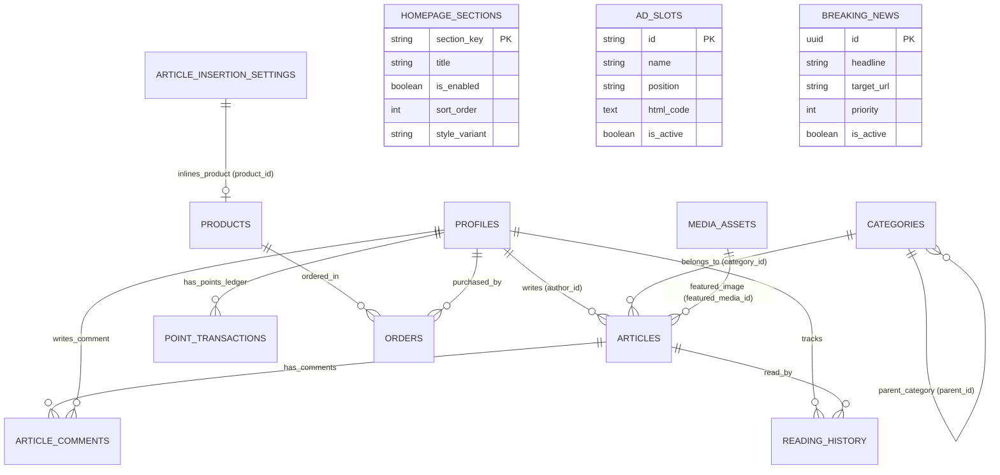

# System Architecture & Complete Workflow Specification
**Project:** SWAPNEWS.CO.ID  
**Doc Version:** 1.0.0 (End-to-End Execution & Database Flow)

---

## 1. High-Level System Architecture Diagram

---

## 2. Comprehensive Feature Workflows (End-to-End)

### Flow 1: Public Traffic, Waiting Room & Article Consumption

---

### Flow 2: Authentication, RBAC & Role Routing

---

### Flow 3: Editorial & Newsroom Lifecycle (Wartawan -> Editor -> Published)

---

### Flow 4: Member Gamifikasi (Reading History, Poin & Penukaran)

---

### Flow 5: Merchandise E-Commerce & Pakasir Payment Gateway

---

### Flow 6: CMS Super Admin & Dynamic Injections

---

## 3. Database Entity Relationship & Data Flow

---

## 4. Keamanan & Efisiensi Data (2026 Standard)

1. **Anti-Egress Query Architecture:**
   - Semua read list memakai selective projections (`id, slug, title, excerpt, ...`).
   - Body HTML penuh (`content`) hanya ditarik saat single article route dibuka.
2. **PostgreSQL Row Level Security (RLS):**
   - Publik hanya bisa `SELECT` artikel berstatus `published`.
   - Wartawan hanya bisa `UPDATE` artikel miliknya yang berstatus `draft`.
   - Super Admin memiliki bypass policy penuh melalui `auth.jwt() -> role = 'super_admin'`.
3. **Webhook Idempotency:**
   - Webhook Pakasir diverifikasi dengan secret signature dan pengecekan status order sebelum memotong stok barang.
